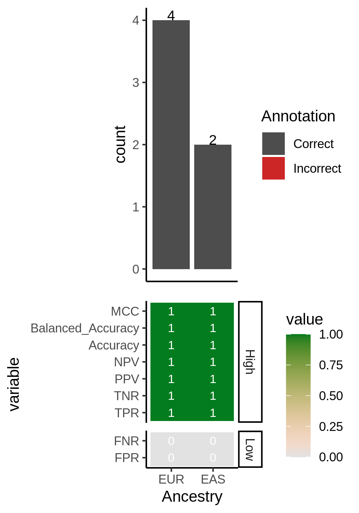
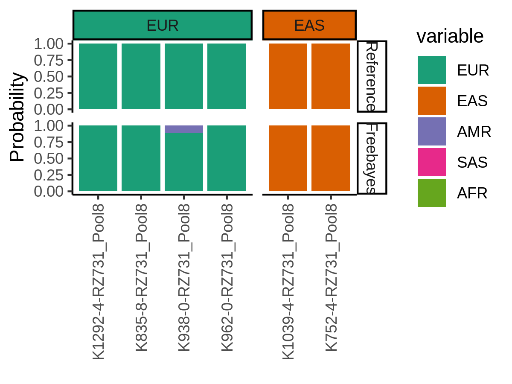

Results!
=========
After running those jobs, you should be done! 

Overview of the Results
--------------------------
The following results should be in your output direcotry.
The first tab provides a truncated results tree to help with visualization but you can see the complete tree from one pool with 6 samples in the second tab (Complete Tree).

.. tabs::

  .. tab:: Truncated Tree

    .. code-block:: bash

      .
      ├── ancestry_assignments.tsv
      ├── Ancestry_PCAs.png
      ├── common_snps_across_pools.tsv
      ├── file_directories.txt
      ├── Pool1
      │   ├── bams
      │   │   ├── 1.bam
      │   │   ├── 1.bam.bai
      │   │   ├── 2.bam
      │   │   ├── 2.bam.bai
      │   │   ├── 3.bam
      │   │   ├── 3.bam.bai
      │   │   ├── 4.bam
      │   │   ├── 4.bam.bai
      │   │   ├── 5.bam
      │   │   ├── 5.bam.bai
      │   │   ├── 6.bam
      │   │   ├── 6.bam.bai
      │   │   └── subset_bam.done
      │   ├── individual_1
      │   │   ├── common_snps
      │   │   │   ├── final_subset_pruned_data.bed
      │   │   │   ├── final_subset_pruned_data.bim
      │   │   │   ├── final_subset_pruned_data.fam
      │   │   │   ├── final_subset_pruned_data.log
      │   │   │   ├── final_subset_pruned_data.pgen
      │   │   │   ├── final_subset_pruned_data.psam
      │   │   │   ├── final_subset_pruned_data.pvar
      │   │   │   ├── snps_1000g.tsv
      │   │   │   ├── SNPs2keep.txt
      │   │   │   ├── snps_data.tsv
      │   │   │   ├── subset_1000g.log
      │   │   │   ├── subset_1000g.pgen
      │   │   │   ├── subset_1000g.psam
      │   │   │   ├── subset_1000g.pvar
      │   │   │   ├── subset_data.log
      │   │   │   ├── subset_data.pgen
      │   │   │   ├── subset_data.prune.out
      │   │   │   ├── subset_data.psam
      │   │   │   ├── subset_data.pvar
      │   │   │   ├── subset_pruned_1000g.bed
      │   │   │   ├── subset_pruned_1000g.bim
      │   │   │   ├── subset_pruned_1000g.fam
      │   │   │   ├── subset_pruned_1000g.log
      │   │   │   ├── subset_pruned_1000g.pgen
      │   │   │   ├── subset_pruned_1000g.popu
      │   │   │   ├── subset_pruned_1000g.prune.in
      │   │   │   ├── subset_pruned_1000g.prune.out
      │   │   │   ├── subset_pruned_1000g.psam
      │   │   │   ├── subset_pruned_1000g.pvar
      │   │   │   ├── subset_pruned_data_1000g_key.txt
      │   │   │   ├── subset_pruned_data.log
      │   │   │   ├── subset_pruned_data_original.pvar
      │   │   │   ├── subset_pruned_data.pgen
      │   │   │   ├── subset_pruned_data.psam
      │   │   │   ├── subset_pruned_data.pvar
      │   │   │   └── subset_pruned_data_temp.pvar
      │   │   ├── freebayes_hg19.vcf
      │   │   ├── freebayes_hg19.vcf.unmap
      │   │   ├── freebayes.log
      │   │   ├── freebayes.pgen
      │   │   ├── freebayes.psam
      │   │   ├── freebayes.pvar
      │   │   ├── freebayes.pvar_original
      │   │   ├── freebayes_tmp.pvar
      │   │   ├── freebayes.vcf
      │   │   ├── pca_projection
      │   │   │   ├── final_subset_pruned_data_pcs.log
      │   │   │   ├── final_subset_pruned_data_pcs.sscore
      │   │   │   ├── subset_pruned_1000g_pcs.acount
      │   │   │   ├── subset_pruned_1000g_pcs.eigenval
      │   │   │   ├── subset_pruned_1000g_pcs.eigenvec
      │   │   │   ├── subset_pruned_1000g_pcs.eigenvec.allele
      │   │   │   ├── subset_pruned_1000g_pcs.log
      │   │   │   ├── subset_pruned_1000g_pcs_projected.log
      │   │   │   └── subset_pruned_1000g_pcs_projected.sscore
      │   │   └── pca_sex_checks_original
      │   │       ├── ancestry_assignments.tsv
      │   │       ├── Ancestry_PCAs.png
      │   │       └── variables.tsv
      │   ├── individual_2
      │   │   ...
      │   ├── individual_3
      │   │   ...
      │   ├── individual_4
      │   │   ...
      │   ├── individual_5
      │   │   ├── common_snps
      │   │   ...
      │   └── individual_6
      │   └── ...
      └── snps_1000g_common_across_sites.tsv

  .. tab:: Complete Tree

    .. code-block:: bash

      .
      ├── ancestry_assignments.tsv
      ├── Ancestry_PCAs.png
      ├── common_snps_across_pools.tsv
      ├── file_directories.txt
      ├── Pool1
      │   ├── bams
      │   │   ├── 1.bam
      │   │   ├── 1.bam.bai
      │   │   ├── 2.bam
      │   │   ├── 2.bam.bai
      │   │   ├── 3.bam
      │   │   ├── 3.bam.bai
      │   │   ├── 4.bam
      │   │   ├── 4.bam.bai
      │   │   ├── 5.bam
      │   │   ├── 5.bam.bai
      │   │   ├── 6.bam
      │   │   ├── 6.bam.bai
      │   │   └── subset_bam.done
      │   ├── individual_1
      │   │   ├── common_snps
      │   │   │   ├── final_subset_pruned_data.bed
      │   │   │   ├── final_subset_pruned_data.bim
      │   │   │   ├── final_subset_pruned_data.fam
      │   │   │   ├── final_subset_pruned_data.log
      │   │   │   ├── final_subset_pruned_data.pgen
      │   │   │   ├── final_subset_pruned_data.psam
      │   │   │   ├── final_subset_pruned_data.pvar
      │   │   │   ├── snps_1000g.tsv
      │   │   │   ├── SNPs2keep.txt
      │   │   │   ├── snps_data.tsv
      │   │   │   ├── subset_1000g.log
      │   │   │   ├── subset_1000g.pgen
      │   │   │   ├── subset_1000g.psam
      │   │   │   ├── subset_1000g.pvar
      │   │   │   ├── subset_data.log
      │   │   │   ├── subset_data.pgen
      │   │   │   ├── subset_data.prune.out
      │   │   │   ├── subset_data.psam
      │   │   │   ├── subset_data.pvar
      │   │   │   ├── subset_pruned_1000g.bed
      │   │   │   ├── subset_pruned_1000g.bim
      │   │   │   ├── subset_pruned_1000g.fam
      │   │   │   ├── subset_pruned_1000g.log
      │   │   │   ├── subset_pruned_1000g.pgen
      │   │   │   ├── subset_pruned_1000g.popu
      │   │   │   ├── subset_pruned_1000g.prune.in
      │   │   │   ├── subset_pruned_1000g.prune.out
      │   │   │   ├── subset_pruned_1000g.psam
      │   │   │   ├── subset_pruned_1000g.pvar
      │   │   │   ├── subset_pruned_data_1000g_key.txt
      │   │   │   ├── subset_pruned_data.log
      │   │   │   ├── subset_pruned_data_original.pvar
      │   │   │   ├── subset_pruned_data.pgen
      │   │   │   ├── subset_pruned_data.psam
      │   │   │   ├── subset_pruned_data.pvar
      │   │   │   └── subset_pruned_data_temp.pvar
      │   │   ├── freebayes_hg19.vcf
      │   │   ├── freebayes_hg19.vcf.unmap
      │   │   ├── freebayes.log
      │   │   ├── freebayes.pgen
      │   │   ├── freebayes.psam
      │   │   ├── freebayes.pvar
      │   │   ├── freebayes.pvar_original
      │   │   ├── freebayes_tmp.pvar
      │   │   ├── freebayes.vcf
      │   │   ├── pca_projection
      │   │   │   ├── final_subset_pruned_data_pcs.log
      │   │   │   ├── final_subset_pruned_data_pcs.sscore
      │   │   │   ├── subset_pruned_1000g_pcs.acount
      │   │   │   ├── subset_pruned_1000g_pcs.eigenval
      │   │   │   ├── subset_pruned_1000g_pcs.eigenvec
      │   │   │   ├── subset_pruned_1000g_pcs.eigenvec.allele
      │   │   │   ├── subset_pruned_1000g_pcs.log
      │   │   │   ├── subset_pruned_1000g_pcs_projected.log
      │   │   │   └── subset_pruned_1000g_pcs_projected.sscore
      │   │   └── pca_sex_checks_original
      │   │       ├── ancestry_assignments.tsv
      │   │       ├── Ancestry_PCAs.png
      │   │       └── variables.tsv
      │   ├── individual_2
      │   │   ├── common_snps
      │   │   │   ├── final_subset_pruned_data.bed
      │   │   │   ├── final_subset_pruned_data.bim
      │   │   │   ├── final_subset_pruned_data.fam
      │   │   │   ├── final_subset_pruned_data.log
      │   │   │   ├── final_subset_pruned_data.pgen
      │   │   │   ├── final_subset_pruned_data.psam
      │   │   │   ├── final_subset_pruned_data.pvar
      │   │   │   ├── snps_1000g.tsv
      │   │   │   ├── SNPs2keep.txt
      │   │   │   ├── snps_data.tsv
      │   │   │   ├── subset_1000g.log
      │   │   │   ├── subset_1000g.pgen
      │   │   │   ├── subset_1000g.psam
      │   │   │   ├── subset_1000g.pvar
      │   │   │   ├── subset_data.log
      │   │   │   ├── subset_data.pgen
      │   │   │   ├── subset_data.prune.out
      │   │   │   ├── subset_data.psam
      │   │   │   ├── subset_data.pvar
      │   │   │   ├── subset_pruned_1000g.bed
      │   │   │   ├── subset_pruned_1000g.bim
      │   │   │   ├── subset_pruned_1000g.fam
      │   │   │   ├── subset_pruned_1000g.log
      │   │   │   ├── subset_pruned_1000g.pgen
      │   │   │   ├── subset_pruned_1000g.popu
      │   │   │   ├── subset_pruned_1000g.prune.in
      │   │   │   ├── subset_pruned_1000g.prune.out
      │   │   │   ├── subset_pruned_1000g.psam
      │   │   │   ├── subset_pruned_1000g.pvar
      │   │   │   ├── subset_pruned_data_1000g_key.txt
      │   │   │   ├── subset_pruned_data.log
      │   │   │   ├── subset_pruned_data_original.pvar
      │   │   │   ├── subset_pruned_data.pgen
      │   │   │   ├── subset_pruned_data.psam
      │   │   │   ├── subset_pruned_data.pvar
      │   │   │   └── subset_pruned_data_temp.pvar
      │   │   ├── freebayes_hg19.vcf
      │   │   ├── freebayes_hg19.vcf.unmap
      │   │   ├── freebayes.log
      │   │   ├── freebayes.pgen
      │   │   ├── freebayes.psam
      │   │   ├── freebayes.pvar
      │   │   ├── freebayes.pvar_original
      │   │   ├── freebayes_tmp.pvar
      │   │   ├── freebayes.vcf
      │   │   ├── pca_projection
      │   │   │   ├── final_subset_pruned_data_pcs.log
      │   │   │   ├── final_subset_pruned_data_pcs.sscore
      │   │   │   ├── subset_pruned_1000g_pcs.acount
      │   │   │   ├── subset_pruned_1000g_pcs.eigenval
      │   │   │   ├── subset_pruned_1000g_pcs.eigenvec
      │   │   │   ├── subset_pruned_1000g_pcs.eigenvec.allele
      │   │   │   ├── subset_pruned_1000g_pcs.log
      │   │   │   ├── subset_pruned_1000g_pcs_projected.log
      │   │   │   └── subset_pruned_1000g_pcs_projected.sscore
      │   │   └── pca_sex_checks_original
      │   │       ├── ancestry_assignments.tsv
      │   │       ├── Ancestry_PCAs.png
      │   │       └── variables.tsv
      │   ├── individual_3
      │   │   ├── common_snps
      │   │   │   ├── final_subset_pruned_data.bed
      │   │   │   ├── final_subset_pruned_data.bim
      │   │   │   ├── final_subset_pruned_data.fam
      │   │   │   ├── final_subset_pruned_data.log
      │   │   │   ├── final_subset_pruned_data.pgen
      │   │   │   ├── final_subset_pruned_data.psam
      │   │   │   ├── final_subset_pruned_data.pvar
      │   │   │   ├── snps_1000g.tsv
      │   │   │   ├── SNPs2keep.txt
      │   │   │   ├── snps_data.tsv
      │   │   │   ├── subset_1000g.log
      │   │   │   ├── subset_1000g.pgen
      │   │   │   ├── subset_1000g.psam
      │   │   │   ├── subset_1000g.pvar
      │   │   │   ├── subset_data.log
      │   │   │   ├── subset_data.pgen
      │   │   │   ├── subset_data.prune.out
      │   │   │   ├── subset_data.psam
      │   │   │   ├── subset_data.pvar
      │   │   │   ├── subset_pruned_1000g.bed
      │   │   │   ├── subset_pruned_1000g.bim
      │   │   │   ├── subset_pruned_1000g.fam
      │   │   │   ├── subset_pruned_1000g.log
      │   │   │   ├── subset_pruned_1000g.pgen
      │   │   │   ├── subset_pruned_1000g.popu
      │   │   │   ├── subset_pruned_1000g.prune.in
      │   │   │   ├── subset_pruned_1000g.prune.out
      │   │   │   ├── subset_pruned_1000g.psam
      │   │   │   ├── subset_pruned_1000g.pvar
      │   │   │   ├── subset_pruned_data_1000g_key.txt
      │   │   │   ├── subset_pruned_data.log
      │   │   │   ├── subset_pruned_data_original.pvar
      │   │   │   ├── subset_pruned_data.pgen
      │   │   │   ├── subset_pruned_data.psam
      │   │   │   ├── subset_pruned_data.pvar
      │   │   │   └── subset_pruned_data_temp.pvar
      │   │   ├── freebayes_hg19.vcf
      │   │   ├── freebayes_hg19.vcf.unmap
      │   │   ├── freebayes.log
      │   │   ├── freebayes.pgen
      │   │   ├── freebayes.psam
      │   │   ├── freebayes.pvar
      │   │   ├── freebayes.pvar_original
      │   │   ├── freebayes_tmp.pvar
      │   │   ├── freebayes.vcf
      │   │   ├── pca_projection
      │   │   │   ├── final_subset_pruned_data_pcs.log
      │   │   │   ├── final_subset_pruned_data_pcs.sscore
      │   │   │   ├── subset_pruned_1000g_pcs.acount
      │   │   │   ├── subset_pruned_1000g_pcs.eigenval
      │   │   │   ├── subset_pruned_1000g_pcs.eigenvec
      │   │   │   ├── subset_pruned_1000g_pcs.eigenvec.allele
      │   │   │   ├── subset_pruned_1000g_pcs.log
      │   │   │   ├── subset_pruned_1000g_pcs_projected.log
      │   │   │   └── subset_pruned_1000g_pcs_projected.sscore
      │   │   └── pca_sex_checks_original
      │   │       ├── ancestry_assignments.tsv
      │   │       ├── Ancestry_PCAs.png
      │   │       └── variables.tsv
      │   ├── individual_4
      │   │   ├── common_snps
      │   │   │   ├── final_subset_pruned_data.bed
      │   │   │   ├── final_subset_pruned_data.bim
      │   │   │   ├── final_subset_pruned_data.fam
      │   │   │   ├── final_subset_pruned_data.log
      │   │   │   ├── final_subset_pruned_data.pgen
      │   │   │   ├── final_subset_pruned_data.psam
      │   │   │   ├── final_subset_pruned_data.pvar
      │   │   │   ├── snps_1000g.tsv
      │   │   │   ├── SNPs2keep.txt
      │   │   │   ├── snps_data.tsv
      │   │   │   ├── subset_1000g.log
      │   │   │   ├── subset_1000g.pgen
      │   │   │   ├── subset_1000g.psam
      │   │   │   ├── subset_1000g.pvar
      │   │   │   ├── subset_data.log
      │   │   │   ├── subset_data.pgen
      │   │   │   ├── subset_data.prune.out
      │   │   │   ├── subset_data.psam
      │   │   │   ├── subset_data.pvar
      │   │   │   ├── subset_pruned_1000g.bed
      │   │   │   ├── subset_pruned_1000g.bim
      │   │   │   ├── subset_pruned_1000g.fam
      │   │   │   ├── subset_pruned_1000g.log
      │   │   │   ├── subset_pruned_1000g.pgen
      │   │   │   ├── subset_pruned_1000g.popu
      │   │   │   ├── subset_pruned_1000g.prune.in
      │   │   │   ├── subset_pruned_1000g.prune.out
      │   │   │   ├── subset_pruned_1000g.psam
      │   │   │   ├── subset_pruned_1000g.pvar
      │   │   │   ├── subset_pruned_data_1000g_key.txt
      │   │   │   ├── subset_pruned_data.log
      │   │   │   ├── subset_pruned_data_original.pvar
      │   │   │   ├── subset_pruned_data.pgen
      │   │   │   ├── subset_pruned_data.psam
      │   │   │   ├── subset_pruned_data.pvar
      │   │   │   └── subset_pruned_data_temp.pvar
      │   │   ├── freebayes_hg19.vcf
      │   │   ├── freebayes_hg19.vcf.unmap
      │   │   ├── freebayes.log
      │   │   ├── freebayes.pgen
      │   │   ├── freebayes.psam
      │   │   ├── freebayes.pvar
      │   │   ├── freebayes.pvar_original
      │   │   ├── freebayes_tmp.pvar
      │   │   ├── freebayes.vcf
      │   │   ├── pca_projection
      │   │   │   ├── final_subset_pruned_data_pcs.log
      │   │   │   ├── final_subset_pruned_data_pcs.sscore
      │   │   │   ├── subset_pruned_1000g_pcs.acount
      │   │   │   ├── subset_pruned_1000g_pcs.eigenval
      │   │   │   ├── subset_pruned_1000g_pcs.eigenvec
      │   │   │   ├── subset_pruned_1000g_pcs.eigenvec.allele
      │   │   │   ├── subset_pruned_1000g_pcs.log
      │   │   │   ├── subset_pruned_1000g_pcs_projected.log
      │   │   │   └── subset_pruned_1000g_pcs_projected.sscore
      │   │   └── pca_sex_checks_original
      │   │       ├── ancestry_assignments.tsv
      │   │       ├── Ancestry_PCAs.png
      │   │       └── variables.tsv
      │   ├── individual_5
      │   │   ├── common_snps
      │   │   │   ├── final_subset_pruned_data.bed
      │   │   │   ├── final_subset_pruned_data.bim
      │   │   │   ├── final_subset_pruned_data.fam
      │   │   │   ├── final_subset_pruned_data.log
      │   │   │   ├── final_subset_pruned_data.pgen
      │   │   │   ├── final_subset_pruned_data.psam
      │   │   │   ├── final_subset_pruned_data.pvar
      │   │   │   ├── snps_1000g.tsv
      │   │   │   ├── SNPs2keep.txt
      │   │   │   ├── snps_data.tsv
      │   │   │   ├── subset_1000g.log
      │   │   │   ├── subset_1000g.pgen
      │   │   │   ├── subset_1000g.psam
      │   │   │   ├── subset_1000g.pvar
      │   │   │   ├── subset_data.log
      │   │   │   ├── subset_data.pgen
      │   │   │   ├── subset_data.prune.out
      │   │   │   ├── subset_data.psam
      │   │   │   ├── subset_data.pvar
      │   │   │   ├── subset_pruned_1000g.bed
      │   │   │   ├── subset_pruned_1000g.bim
      │   │   │   ├── subset_pruned_1000g.fam
      │   │   │   ├── subset_pruned_1000g.log
      │   │   │   ├── subset_pruned_1000g.pgen
      │   │   │   ├── subset_pruned_1000g.popu
      │   │   │   ├── subset_pruned_1000g.prune.in
      │   │   │   ├── subset_pruned_1000g.prune.out
      │   │   │   ├── subset_pruned_1000g.psam
      │   │   │   ├── subset_pruned_1000g.pvar
      │   │   │   ├── subset_pruned_data_1000g_key.txt
      │   │   │   ├── subset_pruned_data.log
      │   │   │   ├── subset_pruned_data_original.pvar
      │   │   │   ├── subset_pruned_data.pgen
      │   │   │   ├── subset_pruned_data.psam
      │   │   │   ├── subset_pruned_data.pvar
      │   │   │   └── subset_pruned_data_temp.pvar
      │   │   ├── freebayes_hg19.vcf
      │   │   ├── freebayes_hg19.vcf.unmap
      │   │   ├── freebayes.log
      │   │   ├── freebayes.pgen
      │   │   ├── freebayes.psam
      │   │   ├── freebayes.pvar
      │   │   ├── freebayes.pvar_original
      │   │   ├── freebayes_tmp.pvar
      │   │   ├── freebayes.vcf
      │   │   ├── pca_projection
      │   │   │   ├── final_subset_pruned_data_pcs.log
      │   │   │   ├── final_subset_pruned_data_pcs.sscore
      │   │   │   ├── subset_pruned_1000g_pcs.acount
      │   │   │   ├── subset_pruned_1000g_pcs.eigenval
      │   │   │   ├── subset_pruned_1000g_pcs.eigenvec
      │   │   │   ├── subset_pruned_1000g_pcs.eigenvec.allele
      │   │   │   ├── subset_pruned_1000g_pcs.log
      │   │   │   ├── subset_pruned_1000g_pcs_projected.log
      │   │   │   └── subset_pruned_1000g_pcs_projected.sscore
      │   │   └── pca_sex_checks_original
      │   │       ├── ancestry_assignments.tsv
      │   │       ├── Ancestry_PCAs.png
      │   │       └── variables.tsv
      │   └── individual_6
      │       ├── common_snps
      │       │   ├── final_subset_pruned_data.bed
      │       │   ├── final_subset_pruned_data.bim
      │       │   ├── final_subset_pruned_data.fam
      │       │   ├── final_subset_pruned_data.log
      │       │   ├── final_subset_pruned_data.pgen
      │       │   ├── final_subset_pruned_data.psam
      │       │   ├── final_subset_pruned_data.pvar
      │       │   ├── snps_1000g.tsv
      │       │   ├── SNPs2keep.txt
      │       │   ├── snps_data.tsv
      │       │   ├── subset_1000g.log
      │       │   ├── subset_1000g.pgen
      │       │   ├── subset_1000g.psam
      │       │   ├── subset_1000g.pvar
      │       │   ├── subset_data.log
      │       │   ├── subset_data.pgen
      │       │   ├── subset_data.prune.out
      │       │   ├── subset_data.psam
      │       │   ├── subset_data.pvar
      │       │   ├── subset_pruned_1000g.bed
      │       │   ├── subset_pruned_1000g.bim
      │       │   ├── subset_pruned_1000g.fam
      │       │   ├── subset_pruned_1000g.log
      │       │   ├── subset_pruned_1000g.pgen
      │       │   ├── subset_pruned_1000g.popu
      │       │   ├── subset_pruned_1000g.prune.in
      │       │   ├── subset_pruned_1000g.prune.out
      │       │   ├── subset_pruned_1000g.psam
      │       │   ├── subset_pruned_1000g.pvar
      │       │   ├── subset_pruned_data_1000g_key.txt
      │       │   ├── subset_pruned_data.log
      │       │   ├── subset_pruned_data_original.pvar
      │       │   ├── subset_pruned_data.pgen
      │       │   ├── subset_pruned_data.psam
      │       │   ├── subset_pruned_data.pvar
      │       │   └── subset_pruned_data_temp.pvar
      │       ├── freebayes_hg19.vcf
      │       ├── freebayes_hg19.vcf.unmap
      │       ├── freebayes.log
      │       ├── freebayes.pgen
      │       ├── freebayes.psam
      │       ├── freebayes.pvar
      │       ├── freebayes.pvar_original
      │       ├── freebayes_tmp.pvar
      │       ├── freebayes.vcf
      │       ├── pca_projection
      │       │   ├── final_subset_pruned_data_pcs.log
      │       │   ├── final_subset_pruned_data_pcs.sscore
      │       │   ├── subset_pruned_1000g_pcs.acount
      │       │   ├── subset_pruned_1000g_pcs.eigenval
      │       │   ├── subset_pruned_1000g_pcs.eigenvec
      │       │   ├── subset_pruned_1000g_pcs.eigenvec.allele
      │       │   ├── subset_pruned_1000g_pcs.log
      │       │   ├── subset_pruned_1000g_pcs_projected.log
      │       │   └── subset_pruned_1000g_pcs_projected.sscore
      │       └── pca_sex_checks_original
      │           ├── ancestry_assignments.tsv
      │           ├── Ancestry_PCAs.png
      │           └── variables.tsv
      └── snps_1000g_common_across_sites.tsv

Inforamtive Results
--------------------

Your output directory will have summarized results in it (``ancestry_assignments.tsv`` and ``Ancestry_PCAs.png``).
There are files of each individual in their separate direcotires in the ``pca_sex_checks_original`` directory (for example ``/path/to/parent/out/dir/Pool1/individual_1/pca_sex_checks_original/Ancestry_PCAs.png``).
Here's an example of each of these;

``ancestry_assignments.tsv``: This file contains the predicted ancestries for all the samples as well as all the principal component locations for each individual (this will be in your output directory ``/path/to/parent/out/dir/ancestry_assignments.tsv``).
The assignments are the second to last column:

+---------+---------+----------+-----------+-----------+-----------+-----------+-----------+----------+-----------+----------+-----------+---------+---------+---------+---------+---------+-------------------------+-------------+
| FID     | IID     | PC1      | PC2       | PC3       | PC4       | PC5       | PC6       | PC7      | PC8       | PC9      | PC10      | AFR     | AMR     | EAS     | EUR     | SAS     | Final_Assignment        | Pool        |
+=========+=========+==========+===========+===========+===========+===========+===========+==========+===========+==========+===========+=========+=========+=========+=========+=========+=========================+=============+
| 0       | 1       | 0.162    | -0.089    | -0.041    | -0.014    | 0.059     | 0.010     | 0.028    | -0.015    | 0.011    | 0.019     | 0       | 0       | 1       | 0       | 0       | EAS                     | RZ731_Pool8 |
+---------+---------+----------+-----------+-----------+-----------+-----------+-----------+----------+-----------+----------+-----------+---------+---------+---------+---------+---------+-------------------------+-------------+
| 0       | 2       | 0.115    | 0.089     | 0.037     | -0.019    | 0.017     | 0.030     | 0.047    | 0.008     | -0.017   | -0.012    | 0       | 0       | 0       | 1       | 0       | EUR                     | RZ731_Pool8 |
+---------+---------+----------+-----------+-----------+-----------+-----------+-----------+----------+-----------+----------+-----------+---------+---------+---------+---------+---------+-------------------------+-------------+
| 0       | 3       | 0.147    | -0.101    | -0.089    | -0.001    | 0.116     | 0.014     | 0.006    | 0.037     | 0.027    | -0.035    | 0       | 0       | 1       | 0       | 0       | EAS                     | RZ731_Pool8 |
+---------+---------+----------+-----------+-----------+-----------+-----------+-----------+----------+-----------+----------+-----------+---------+---------+---------+---------+---------+-------------------------+-------------+
| 0       | 4       | 0.150    | 0.108     | 0.023     | -0.062    | 0.029     | 0.024     | -0.010   | -0.008    | -0.034   | -0.013    | 0       | 0       | 0       | 1       | 0       | EUR                     | RZ731_Pool8 |
+---------+---------+----------+-----------+-----------+-----------+-----------+-----------+----------+-----------+----------+-----------+---------+---------+---------+---------+---------+-------------------------+-------------+
| 0       | 5       | 0.132    | 0.069     | -0.033    | -0.029    | 0.045     | 0.017     | 0.020    | -0.011    | 0.011    | 0.023     | 0       | 0.11    | 0       | 0.89    | 0       | EUR                     | RZ731_Pool8 |
+---------+---------+----------+-----------+-----------+-----------+-----------+-----------+----------+-----------+----------+-----------+---------+---------+---------+---------+---------+-------------------------+-------------+
| 0       | 6       | 0.149    | 0.105     | -0.022    | -0.053    | 0.063     | 0.083     | -0.014   | -0.029    | -0.020   | 0.008     | 0       | 0       | 0       | 1       | 0       | EUR                     | RZ731_Pool8 |
+---------+---------+----------+-----------+-----------+-----------+-----------+-----------+----------+-----------+----------+-----------+---------+---------+---------+---------+---------+-------------------------+-------------+

``Ancestry_PCAs.png``: a separate figure generated for each individual in each pool. For example, a PCA plot for individual 1 in Pool 1: ``/path/to/parent/out/dir/Pool1/individual_1/pca_sex_checks_original/Ancestry_PCAs.png``.

- This figure shows the 1000G individual locations in PC space compared to the individual. For example:

  .. figure:: ../_figures/Ancestry_PCAs.png
    :figwidth: 800px

    
- There will be an ``ancestry_assignments.tsv`` file generated for each individual in each pool and one that has all the individuals joined together in the base output directory.

  - This file has the annotations and probabilities for each pool. For example:

  +---------+---------+-----------------+---------------+-----------------+-----------------+-----------------+-----------------+-----------------+-----------------+------------+------------+---------+---------+---------+---------+---------+---------------------+------------------+
  | FID     | IID     | PC1             | PC2           | PC3             | PC4             | PC5             | PC6             | PC7             | PC8             | PC9        | PC10       | AFR     | AMR     | EAS     | EUR     | SAS     | combined_assignment | Final_Assignment |
  +=========+=========+=================+===============+=================+=================+=================+=================+=================+=================+============+============+=========+=========+=========+=========+=========+=====================+==================+
  | 0       | Poool1  | 0.137           | -0.108        | -0.0250         | -0.042          | 0.032           | -0.042          | 0.001           | -0.021          | -0.086     | -0.019     | 0       | 0       | 1       | 0       | 0       | EAS                 | EAS              |
  +---------+---------+-----------------+---------------+-----------------+-----------------+-----------------+-----------------+-----------------+-----------------+------------+------------+---------+---------+---------+---------+---------+---------------------+------------------+

Additional Results with Reference-based Exectution
----------------------------------------------------

If you have reference SNP genotypes (*i.e.* microarray or whole exome or genome sequencing-called SNPs) and decided to estimate SNP-based ancestry, you will have additional results that compare the reference and single-cell ancestry predictions.
These will be located in:

- ``/path/to/parent/out/dir/reference``: This will contain the ancestry predictions for the reference-based ancestry predictions per individual.

- ``/path/to/parent/out/dir/ref_sc_ancestry_prediction_comparison``: This will provide results on reference vs single cell based ancestry predictions. These are the main comparison files with the two most informative ones highlighted and additional information below:

.. code-block:: bash
  :emphasize-lines: 6,7

  snp_ancestry_predictions.tsv
  reference_ancestry_numbers.png
  predicted_ancestry_numbers_correct.png
  predicted_ancestry_numbers_correct_identified.png
  statistics_heatmap.png
  predicted_numbers_statistics_heatmap_combined.png
  assignments_probabilities_w_ref.png

The ``predicted_numbers_statistics_heatmap_combined.png`` figure shows the number of individuals classified to each ancestry with the single cell data and colored by if they correctly or incorrectly match the reference-annotated SNP genotype data
and the heatmap below shows some statistical metrics for quantifying the single cell derived ancestry predictions:

The ``assignments_probabilities_w_ref.png`` figure show the probability of each sample to be classified to each of the different ancestries. 
This includes the reference-based predictions (microarray or whole exome or genome sequencing data) compared to the single cell based predictions

